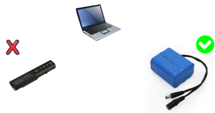

# LEB-Monitoring
 Monitor your External Laptop Battery using this Program, no need to buy a new battery, create your own 3S battery, and connect it to a laptop for a long run time.


<p align="center">
  
</p>

## Components & Software
- NodeMCU ESP8266
- Battery 3S
- (1x) 1K Resistor
- (1x) 10K Resistor
- Hotspot Software (Autostart)
- Python 3

## Wiring Diagram
coming soon

## Setup
```
pip install -r requirements.txt
```
Edit ESP Wifi Client
```
#define STASSID "LEB-Monitoring"
#define STAPSK  "12345678"
```
Edit ESP Static IP
```
IPAddress ip(192,168,5,5);   
IPAddress gateway(192,168,5,1);   
IPAddress subnet(255,255,255,0);  
```
- You can adjust Static IP Address from hotspot software on windows, for example MyPublicWifi (https://mypublicwifi.com/), then upload code to ESP using Arduino IDE.
- Set auto startup software using windows task scheduler for bypass ask administrator permission on boot
- Set auto startup python to run start.py using shortcut
```
/path/pythonw.exe start.py
```
Enjoy

<a href="https://www.buymeacoffee.com/habibulilalbaab" target="_blank"></a>
