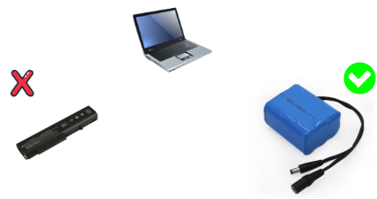

# LEB-Monitoring
<p align="center">
 
 <a href="https://github.com/habibulilalbaab/LEB-Monitoring/blob/main/LICENSE"></a>
 <a href="https://github.com/habibulilalbaab/LEB-Monitoring/stargazers"></a>
 
 
 </p>

LEB-Monitoring "Laptop External Battery Monitoring" Monitor your External Laptop Battery via tray icon operating system, or web browser using LEB-Monitoring, not need to buy a new battery, create your own 3S battery, and connect it to a laptop for a long run time as internal or backup battery aka laptop power bank.


<p align="center">
  
</p>

## Features
- Show Battery Percentage, Voltage, Status, and Level.
- Tray Icon to monitoring battery like internal battery.
- Toast notification to notify critical battery.
- Monitor your 3S battery using web browser with access ESP IP Address.
- Auto charging battery when connecting charger.
- Works as internal battery or backup battery aka laptop power bank (you need setup buck converter if using power bank mode).

## Components & Software
- NodeMCU ESP8266
- Battery 3S
- BMS 3S to protect your battery
- (1 Pair) Battery Connector
- (1x) 1K Resistor
- (1x) 10K Resistor
- Hotspot Software (Autostart)
- Python 3

## Wiring Diagram
coming soon

## Setup
- Install package requirements to your laptop
```
pip install -r requirements.txt
```
- Edit Configuration File "config.py"
```
ip_address = "192.168.5.5" # static ip address nodemcu esp
```
- Install hotspot software on your laptop, for example MyPublicWifi https://mypublicwifi.com/
- Open NodeMCU Code/ESP8266.ino using Arduino IDE
- Edit ESP Wifi Client Base on Hotspot Software "NodeMCU Code/ESP8266.ino"
```
#define STASSID "LEB-Monitoring"
#define STAPSK  "12345678"
```
- Edit ESP Static IP  Base on Hotspot Software "NodeMCU Code/ESP8266.ino"
```
IPAddress ip(192,168,5,5);   
IPAddress gateway(192,168,5,1);   
IPAddress subnet(255,255,255,0);  
```
- You can adjust Static IP Address from hotspot software.
- Upload code to ESP using Arduino IDE.
- Set auto startup hotspot software using windows task scheduler for bypass ask administrator permission on boot.
- Set auto startup python to run start.py using shortcut like below:
```
/path/pythonw.exe start.py
```
## Compatibility Operating System
- Windows 10
- <i>coming soon</i>


Enjoy

<a href="https://www.buymeacoffee.com/habibulilalbaab" target="_blank"></a>
